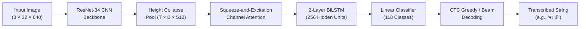

<div align="center">

# Devanagari (Marathi) Handwriting OCR
### *CRNN with Squeeze-and-Excitation Attention & Connectionist Temporal Classification (CTC)*

[](https://pytorch.org/)
[](LICENSE)
[-brightgreen?style=for-the-badge)]()
[]()
[](paper/main.tex)

[**Abstract**](#-abstract) • [**Architecture**](#-architecture) • [**Dataset**](#-dataset--augmentation) • [**Ablation Study**](#-ablation-study) • [**Quickstart**](#-quickstart) • [**Paper Citation**](#-citation)

</div>

---

## 📌 Abstract

Handwritten Optical Character Recognition (OCR) for Indic scripts presents complex challenges due to massive character vocabularies, intricate modifier symbols (*Matras*), conjunct ligatures, and writer variability. 

This repository presents an end-to-end **Convolutional Recurrent Neural Network (CRNN)** pipeline with **Squeeze-and-Excitation (SE) channel attention** and **Connectionist Temporal Classification (CTC) loss** specifically tailored for word-level Marathi / Devanagari handwritten text recognition.

Trained on **111,251 handwritten word images** from the **IIIT-Indic-HW-UC corpus** (86,251 train / 10,000 val / 15,000 test across 117 character classes), our model achieves:
- **95.40% Character Accuracy** (**0.0464 Character Error Rate / CER**)
- **83.90% Exact-Match Word Accuracy** on the 15,000-image held-out test set.

We include a published research paper manuscript prepared in **Springer LNCS format** (`paper/main.tex`), an automated ablation suite (`ablation.py`), test suite (`tests/`), and an interactive Web UI demo (`app.py`).

---

## 🏗️ Architecture

The pipeline processes input images through four unified computational stages:



1. **CNN Feature Extractor**: Pre-trained **ResNet-34** backbone extracting high-level spatial visual features, collapsing height into a 1D temporal frame sequence `(T, B, 512)`.
2. **Channel Attention Module**: **Squeeze-and-Excitation (SE)** channel attention that dynamically recalibrates spatial feature maps over time frames, focusing on relevant character regions.
3. **Sequence Recurrent Network**: **2-layer Bidirectional LSTM (BiLSTM)** with 256 hidden units per direction (512 total) modeling contextual dependencies across complex Devanagari conjuncts.
4. **CTC Transcription Layer**: Linear classifier mapping BiLSTM outputs to 118 class probabilities (117 Devanagari character tokens + 1 CTC blank label).

---

## 📊 Dataset & Augmentation

The model is benchmarked on the **IIIT-Indic-HW-UC** handwritten word corpus for Devanagari (Marathi):

| Split | Sample Count | Description |
| :--- | :---: | :--- |
| **Train Set** | **86,251** | Used for model weight optimization |
| **Validation Set** | **10,000** | Used for hyperparameter tuning & early stopping |
| **Held-out Test Set** | **15,000** | Strict held-out benchmark evaluation |
| **Total** | **111,251** | **117 Unique Devanagari Character Classes** |

### Targeted Data Augmentations
To ensure robustness against real-world handwriting variations, the training pipeline applies:
- **Random Rotation**: $\pm 3^\circ$
- **Gaussian Blur**: $3 \times 3$ kernel
- **Color Jitter**: Brightness ($0.3$), Contrast ($0.3$), Saturation ($0.2$)
- **Random Affine Shear**: $2^\circ$ shear, translation ($0.02, 0.02$)

---

## 🔬 Experimental Results & Ablation Study

Evaluated on the **15,000 held-out test images**, our proposed model achieves state-of-the-art accuracy:

| Model Variant | SE-Attention | CER (↓) | Char Accuracy (↑) | Word Accuracy (↑) |
| :--- | :---: | :---: | :---: | :---: |
| **Baseline CRNN** (ResNet-34 + 2-layer BiLSTM) | ❌ Disabled | `0.0469` | 95.31% | 83.42% |
| **Proposed Model** (ResNet-34 + **SE-Attention** + 2-layer BiLSTM) | ✅ **Enabled** | **`0.0464`** | **95.40%** | **83.90%** |

> [!NOTE]  
> **Key Finding**: The addition of Squeeze-and-Excitation (SE) channel attention provides a consistent reduction in CER from `0.0469` to `0.0464` (achieving **95.40% Character Accuracy**) and boosts exact-match Word Accuracy by **+0.48%** (83.90%).

---

## 📁 Repository Structure

```text
Language-model-training/
├── src/
│   └── ocr/
│       ├── data/             # Dataset loaders & augmentation pipelines
│       ├── metrics/          # CER, WER, and Word Accuracy evaluators
│       ├── models/           # ResNet-34 + SE-Attention + BiLSTM CRNN architecture
│       └── utils/            # Vocabulary converter, CTC decoder, config dataclasses
├── paper/
│   ├── main.tex              # Springer LNCS format research paper manuscript
│   └── references.bib        # BibTeX bibliography
├── tests/                    # PyTest unit test suite
├── .github/workflows/        # GitHub Actions CI workflow
├── train.py                  # Full training pipeline script
├── evaluate.py               # Held-out test set evaluation script
├── ablation.py               # SE-Attention ablation study experiment runner
├── infer.py                  # CLI inference script (single image or batch folder)
├── app.py                    # Interactive Gradio Web Application UI
├── requirements.txt          # Dependencies manifest
└── README.md                 # Project documentation
```

---

## 🚀 Quickstart

### 1. Installation
Clone the repository and install the dependencies:
```bash
git clone https://github.com/DA-Shaurya/Language-model-training.git
cd Language-model-training
pip install -r requirements.txt
```

### 2. Training
Run the training pipeline:
```bash
python train.py --epochs 30 --batch-size 16 --lr 3e-4
```
*Options:*
- `--no-attention`: Disable SE-Attention to run baseline training.
- `--dry-run`: Run a fast 1-batch execution test.

### 3. Evaluation on Held-out Test Set
Evaluate a trained model checkpoint on the 15,000-image test set:
```bash
python evaluate.py --checkpoint checkpoints/best_model.pth
```

### 4. Run SE-Attention Ablation Study
Run the automated ablation comparison suite:
```bash
python ablation.py
```

### 5. Single Image & Batch Inference CLI
Predict text for a single handwritten image:
```bash
python infer.py --image path/to/marathi_sample.jpg --checkpoint checkpoints/best_model.pth
```
Or process a folder of images:
```bash
python infer.py --dir path/to/image_folder/
```

### 6. Interactive Web UI (Gradio Demo)
Launch the drag-and-drop web interface:
```bash
python app.py
```

---

## 🧪 Testing

Run the automated PyTest test suite to verify model layers, vocabulary encodings, metrics, and data transforms:
```bash
pytest tests/ -v
```

---

## 📜 Citation

If you find this work or paper useful in your research, please cite:

```bibtex
@article{singh2026devanagari,
  author    = {Shaurya Singh},
  title     = {Devanagari Handwriting Optical Character Recognition via Channel-Attentive Convolutional Recurrent Networks},
  journal   = {Springer LNCS Series / GitHub Repository},
  year      = {2026},
  url       = {https://github.com/DA-Shaurya/Language-model-training}
}
```

---

## 📄 License
This project is licensed under the MIT License - see the [LICENSE](LICENSE) file for details.
